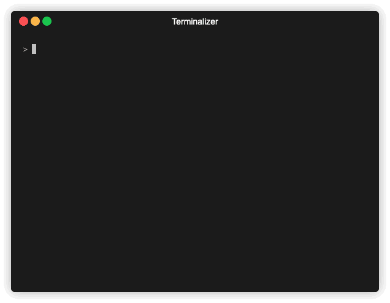

# Philosophers in 42 project

Code for Dining Philosophers Problem



## philo

with multi thread and mutex

### Usage

```sh
> cd philo
> make
> ./philo
Usage: ./philo PN TD TE TS [EC]

        PN = number of philosophers
        TD = time to die
        TE = time to eat
        TS = time to sleep
        EC = number of times each philosopher must eat
```

## philo_bonus

with multi processes and semaphore

### Usage

```sh
> cd philo_bonus
> make
> ./philo_bonus
Usage: ./philo PN TD TE TS [EC]

        PN = number of philosophers
        TD = time to die
        TE = time to eat
        TS = time to sleep
        EC = number of times each philosopher must eat
```
